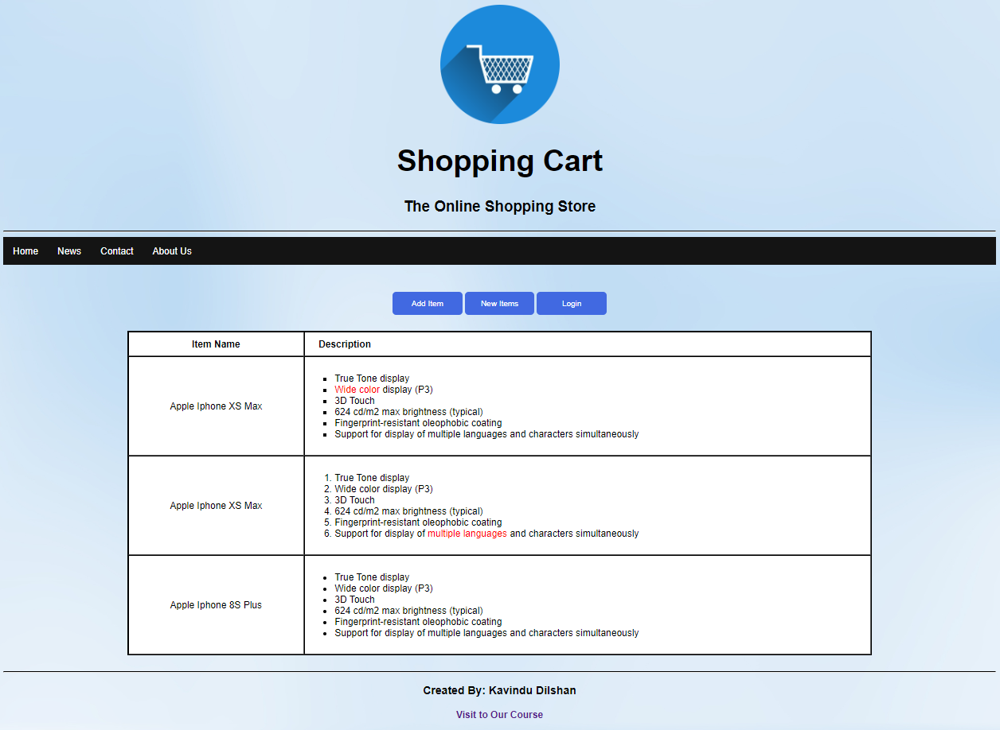

# IT1100 - IWT Lab Exercise
This is the lab exercise done in the lab sessions of the IWT module of SLIIT.

 

## Description
This project is a website for an online shopping cart created with HTML, CSS, JS, PHP, and MySQL. XAMPP is used to configure PHP and MySQL.
 

